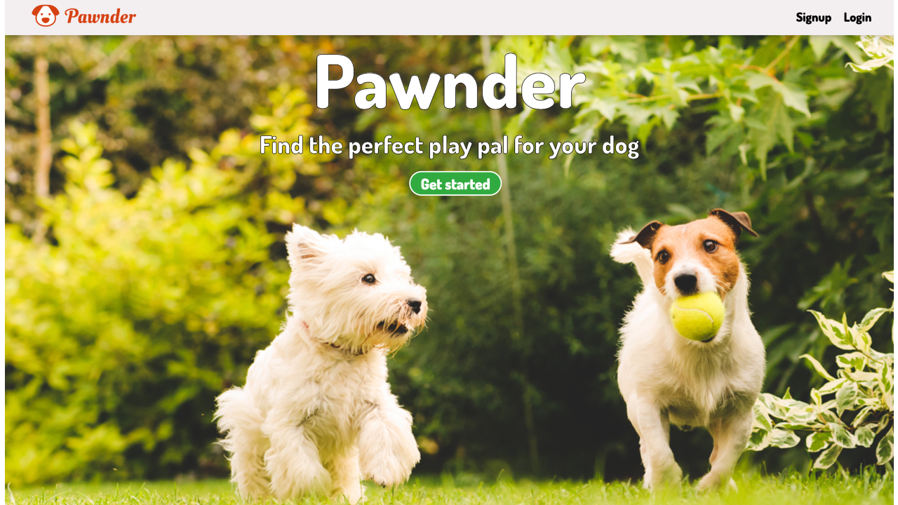

# Pawnder

<br/>
Live demo - http://pawnderapp.herokuapp.com/

## 📖 Table of Contents
- [About](#about)
- [Demo](#demos)
- [Setup](#setup)
- [Author](#author)

## ✍🏻 About <a name="about"></a>

### Why Make This?

Pawnder was created so dog owners can each other and set up playdates. Dog parks can be a good way to meet local dogs, but you just never know who's going to be there, and wheter or not your dog might get along with them. That's where Pawnder comes in! You can search for your city to see all local dogs, and filter them based on their breeds and activity levels. You know your dog best and with Pawnder you can find their perfect playdate.

### Process

1.  Create a frontend interface using React.Js
2.  Connect it to a backend Express server
3.  Create an online MongoDB database that would store all of my user accounts
4.  Allow user creation and authentication using Mongoose and bcrypt
5.  Add Cloudinary support for user uploaded images
6.  Use Google Maps API support for an online map component
7.  Integrate search and filtering using JavaScript array logic
8.  Allow for users to make posts on their pages using Mongoose's push to model function

#### For more details on the code and logic used, please refer to the comments and documentation inside of the code.*

## 💻 Demo <a name="demos"/>
Live demo - http://pawnderapp.herokuapp.com/

## 🛠 Setup <a name="setup"/>

### Installation

*   [Clone the repo](https://github.com/alegomez1/MetroTimes-React-Native)
*   Use ```npm install``` or ```yarn install``` to install the necessary dependencies
*   Use ```npm start``` to start the frontend interface and server
*   Visit localhost:3000 for frontend interface and localhost:5000 for server


## 📦 Created using:
* [React.js](https://reactjs.org/) - Frontend
* [Express](https://expressjs.com/) -Backend Server
* [Javascript](https://www.javascript.com/) - Frontend and backend
* [MongoDB](https://www.mongodb.com/) - Online database
* [Mongoose](https://mongoosejs.com/) - Object modeling
* [Cloudinary](https://cloudinary.com/) - Stores user uploaded photos
* [bcrypt](https://www.npmjs.com/package/bcrypt) - Authentication
* [Google Maps](https://developers.google.com/maps/documentation) - Google Maps Component

## 🙋🏼‍♂️ Created by: <a name="author"></a>
* [Alejandro Gomez](https://github.com/alegomez1)
